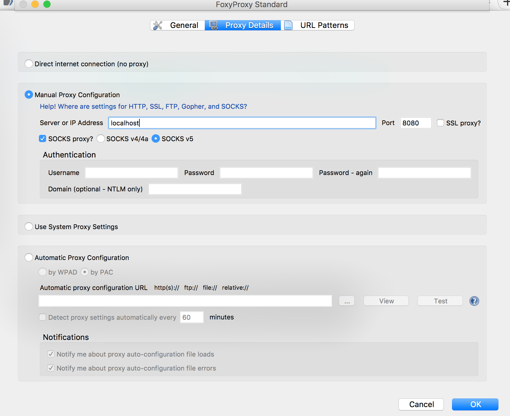
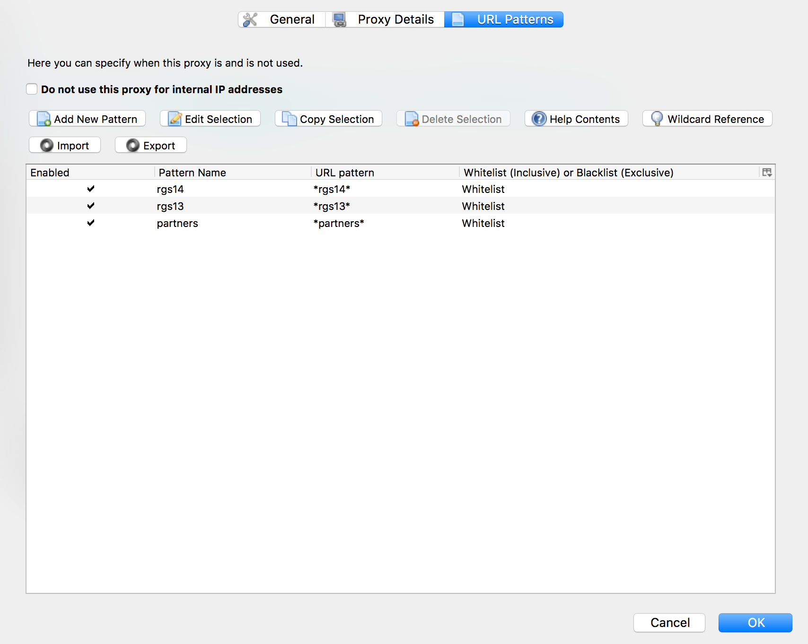

```{r setup, include=FALSE}
knitr::opts_chunk$set(echo = TRUE)
```

## Document Goal

Describe how to connect to the `Erisone` HPC environment with a variety of tips and tricks via `ssh`. Specifically, this will illustrate how to access the servers without a VPN **and** access RStudio sessions on `rgs13` and `rgs14` using a URL-aware proxy. Throughout the document, I'll use `cl322` as the username that's affiliated with Partner's (this is Caleb's username). 
<br>

## Quick start into the different servers

- `ssh.partners.org` A public-facing server that facilitates `ssh` tunningly. 
- `ssh3.partners.org` A more standard login node for general use in `Erisone`. Don't run code on this. Accessible only from inside. 
- `rgs13.research.partners.org` One of the lab's login nodes that can faciliate some interactive execution. Accessible only from inside. 
- `rgs14.research.partners.org` Another of the lab's login nodes that can faciliate some interactive execution. Accessible only from inside. 

**TLDR: **Use `rgs13` and `rgs14` whenever possible to actually do work. 

## Easy, obvious way to connect

- Connect to Partners VPN using your username/password (log into `partners.org/vpn`). **TIP:** I regularly run into connection issues using Chrome and Firefox due to (I think) Adobe Flash being blocked by these servers. 
- With the VPN connection established, `ssh` into `Erisone`: 

```
ssh cl322@rgs13.research.partners.org
```
<br>

## Accessing RStudio with a VPN
Once connected to the VPN, simply enter the following to connect to the workstation's Rstudio server instance--
```
https://rgs13.research.partners.org/rstudio/
https://rgs14.research.partners.org/rstudio/
```

`rgs14` is running the Pro version, which faciliates multiple versions of R. This is the ideal instance to use likely. 

<br> 

## Setting up SSH Tunneling
Perhaps we may be interested in accessing the work station without using the VPN. This may be particularly useful if we want to transfer files between servers. To get the keys needed to setup tunneling, fill out this form:

```
https://rc.partners.org/ssh-bastion-request
```

Shortly hafter submitting your ssh request, you'll get login key files and a super secret password. IT support has this file that has a good description of how to configure this on your machine. 

```
https://rc.partners.org/kb/article/2891
```

Assuming that you have this all setup, when you `ssh` to the public facing server, you'll get prompted to give your passphrase that was emailed to your separately. This is annoying to keep typing. You can [permenantly add your passcode](https://stackoverflow.com/questions/3466626/add-private-key-permanently-with-ssh-add-on-ubuntu) using the following command: 

```
ssh-add -K ~/.ssh/id_ecdsa
```

**Note:** be sensitive to the actual name of the file (_i.e._ if you changed it when transferring files form the Erisone emails). 

<br> 

## Actually SSH Tunneling
Okay so To do this, we're going to create an `ssh` tunnel to the workstation through a publically facing `Erisone` server (_i.e._ `ssh.partners.org`). Here are the basic steps--

- Open two terminal windows. 
- In one terminal window, we're going to expose an internal server ssh port (`22`) to a **local port** `2213` like so--
```
ssh -L 2213:rgs13.research.partners.org:22 -L cl322@ssh.partners.org
```

- After password authentication and two-factor authentication, this terminal window will bridge the wortkstation and the currently used computer through port `2213`. Note: `2213` was a semi-arbitrary choice on my part. You can realistically do any number of ports, but some (e.g. `22` are blocked for specific purposes. Unless you know what you're doing, just stick to `2213`). 
- After setting up the conenction above, minimize this terminal window. It has to be active and running for the subsequent steps to work. 
- Now, we can `ssh` or `scp` to the workstation using this exposed port (and thus without the need to VPN) using the second terminal window.
- To `ssh`, we have to remove the strict RSA key checking since our login is a dynamic process and point our connection to the exposed port via local host: 
```
ssh -o StrictHostKeyChecking=no -p 2213 cl322@localhost
```
<br> <br>

## Accessing RStudio w/o VPN
Using the `ssh` tunnel, we can route our web traffic through the Partners server using a Socks Proxy by binding a port (e.g. `8080`) using `ssh` (e.g. `-D 8080`; see the other sections below for synchrony with this and the other tunnel happenings). 

One of the more useful features that I've discovered is using [FoxyProxy](https://getfoxyproxy.org/), which enables a URL-aware execution of the Socks Proxy. In other words, you can configure it to only route traffic through the Partners server if the URL matches some regular expression. I've configured my settings like so: 


```
-
```



With the proxy settings set up like this, we can access the RStudio URLs automatically as long as our Socks Proxy is established. 

```
https://rgs13.research.partners.org/rstudio/
https://rgs14.research.partners.org/rstudio/
```

## Aliases
-All of these commands can be added to your `.bashrc` or `.bash_profile` file under simple commands that will make your life much, much easier. Ask Caleb if you want to do this/don't know how to do this. For example, we can change the first command that builds the tunnel using the following command:
```
echo  m="ssh -L 2213:rgs13.research.partners.org:22 -L 2214:rgs14.research.partners.org:22 -L 8789:rgs14.research.partners.org:80 cl322@ssh.partners.org" >> ~/.bashrc
```
which will allow you to replace the command to tunnel to the server by simply typing `m` rather than the long `ssh` command. 

<br> 

## Moving Files via ssh tunneling
Perhaps we want to `scp` files, such as all the single-cell ATAC `bam` files. This can be done using the form of the following command:
```
scp -o StrictHostKeyChecking=no -o UserKnownHostsFile=/dev/null -P 2213 `find ./ -name "singles*bam"` cl322@localhost:/data/aryee/OTHERPATHINFORMATIOn
```

An important thing to not here is that the `scp` synatx requires a captial "P" whereas `ssh` uses a lowercase "p" to specify the port.
<br>

- Rather than watching all of the files transfer, we may want to throw the command in the background. This way, we can close our windows and do something else. See the discussion [here](https://bharatikunal.wordpress.com/2010/10/20/scp-as-a-background-process/).
- Alternatively, use [Screen](https://www.rackaid.com/blog/linux-screen-tutorial-and-how-to/) to facilitate the file transfer. This keeps the session robust to the connection breaking. 

<br>

## Putting it all together
or at least this is how Caleb's set it up on his machine. In my `~/.bashrc` file, I have added all of the following aliases and commands: 

```
alias m="ssh -L 2213:rgs13.research.partners.org:22 -L 2214:rgs14.research.partners.org:22 -D 8080 cl322@ssh.partners.org"

alias rgs13tunnel="ssh -o StrictHostKeyChecking=no -o UserKnownHostsFile=/dev/null -p 2213 cl322@localhost"
alias rgs14tunnel="ssh -o StrictHostKeyChecking=no -o UserKnownHostsFile=/dev/null -p 2214 cl322@localhost"

alias scprgs13="scp -o StrictHostKeyChecking=no -o UserKnownHostsFile=/dev/null -P 2213"

```

Then, I can 1) build the tunnel using just the `m` command in a terminal window, 2) easily access the login servers `rgs13` and `rgs14` using the tunneling, 3) have established aliases for copying files, and 4) access RStudio server instances using a Socks Proxy. Using FoxyProxy, the only traffic that routes through the Partners network are websites that match a URL pattern that includes `rgs13` or `rgs14`. 


<br> 